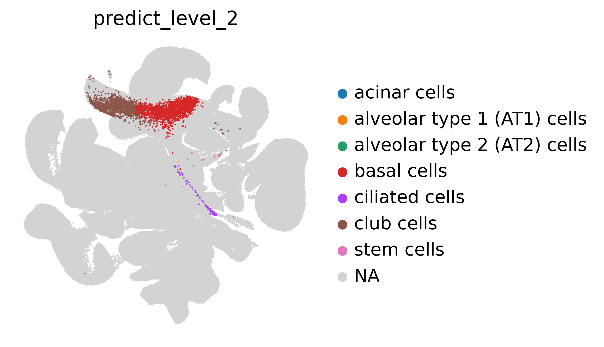

# sc2heoca
A method to query new organoid scRNA-seq data to HEOCA

## Install
```
conda create -n sc2heoca python==3.9.16
conda activate sc2heoca

git clone git@github.com:devsystemslab/sc2heoca.git
pip install sc2heoca/
```

## Prepare reference atlas and model

* Download the reference atlas from Zenodo
```
mkdir -p heoca_atlas
cd heoca_atlas
wget https://zenodo.org/records/10977447/files/gut_scpoli_integration.h5ad
```

* Download the reference model from Zenodo
```
wget https://zenodo.org/record/8186773/files/heoca_scpoli_model.v1.0.zip
tar xvzf heoca_scpoli_model.v1.0.zip -C heoca_atlas
rm heoca_scpoli_model.v1.0.zip
```

* Reference atlas and available reference models from HEOCA project

    - [HEOCA atlas (all organoids)](https://zenodo.org/records/10977447/files/gut_scpoli_integration.h5ad)
    - [HEOCA model (all organoids)](https://zenodo.org/record/8186773/files/heoca_scpoli_model.v1.0.zip)
    - [HIOCA model (intestine organoid)](https://zenodo.org/record/8186773/files/hioca_scpoli_model.v1.0.zip)
    - [HLOCA model (lung organoid)](https://zenodo.org/record/8186773/files/hioca_scpoli_model.v1.0.zip)
    - [HICA model (intestine tissue)](https://zenodo.org/record/8186773/files/hica_scpoli_model.v1.0.zip)

## Query new organoid single cell RNA-seq data

Example data download from [GEO(GSM5628936)](https://www.ncbi.nlm.nih.gov/geo/query/acc.cgi?acc=GSM5628936)

```
import scanpy as sc
from sc2heoca.sc2heoca import Query
```

* Load new sample
```
adata_query = sc.read_10x_mtx(path='Chan_NatCommun_2022', 
                              prefix='GSM5628936_SCNPO2-')
```
* Query new sample
```
model_dir = "heoca_atlas"
query = Query(model_dir=model_dir, 
              adata_query=adata_query, 
              sample_name='GSM5628936_SCNPO2',
              load_ref=True)
query.run_scpoli()
```

* Plot query result UMAP
```
adata4plot = query.merge4plot()
sc.pl.umap(adata4plot, color=['predict_level_2'], palette=query.colorplate,
           frameon=False, size=5)
```

* Find DE genes to HECOA

```
de_res = query.find_de_genes(tissue='lung')

```

<td></img></a></td>

## Help and Support

* The preferred way to get support is through the [Github issues page](https://github.com/devsystemslab/sc2heoca/issues).

